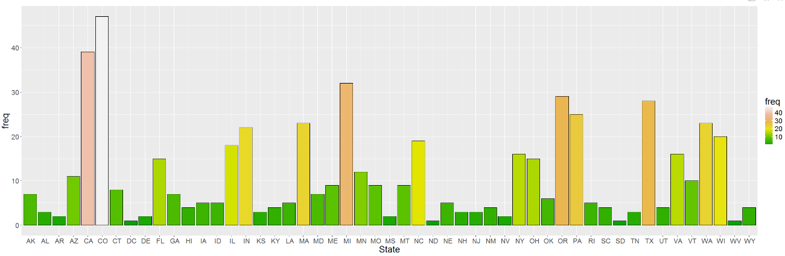
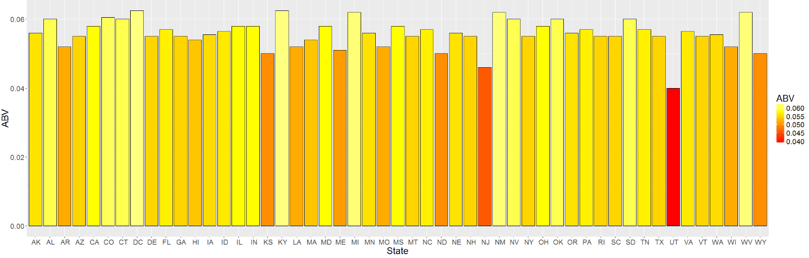
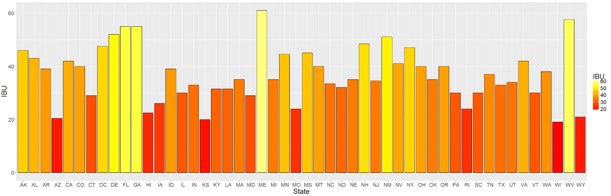
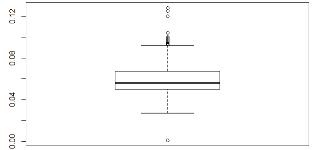
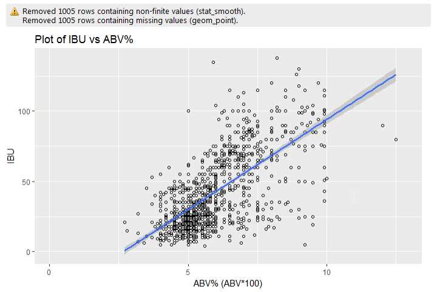

# Craft Beer Analysis
Ashwin Thota  
June 30, 2017  


##Data Set Description:
Beers dataset contains a list of 2410 US craft beers and Breweries dataset contains 558 US breweries. The datasets descriptions are as follows.
**Beers.csv:**
Name: Name of the beer.
Beer ID: Unique identifier of the beer.
ABV: Alcohol by volume of the beer.
IBU: International Bitterness Units of the beer.
Brewery ID: Brewery id associated with the beer.
Style: Style of the beer.
Ounces: Ounces of beer.

**Breweries.csv:**
Brew ID: Unique identifier of the brewery.
Name: Name of the brewery.
City: City where the brewery is located.
State: State where the brewery is located.

```r
library(plyr)
```

```
## Warning: package 'plyr' was built under R version 3.3.3
```

```r
beers <- read.csv("https://raw.githubusercontent.com/AshwinThotaDS/CaseStudy1/master/Data/Beers.csv",header=TRUE)
breweries<-read.csv("https://raw.githubusercontent.com/AshwinThotaDS/CaseStudy1/master/Data/Breweries.csv",header=TRUE)
head(breweries)
```

```
##   Brew_ID                      Name          City State
## 1       1        NorthGate Brewing    Minneapolis    MN
## 2       2 Against the Grain Brewery    Louisville    KY
## 3       3  Jack's Abby Craft Lagers    Framingham    MA
## 4       4 Mike Hess Brewing Company     San Diego    CA
## 5       5   Fort Point Beer Company San Francisco    CA
## 6       6     COAST Brewing Company    Charleston    SC
```

```r
head(beers) 
```

```
##                  Name Beer_ID   ABV IBU Brewery_id
## 1            Pub Beer    1436 0.050  NA        409
## 2         Devil's Cup    2265 0.066  NA        178
## 3 Rise of the Phoenix    2264 0.071  NA        178
## 4            Sinister    2263 0.090  NA        178
## 5       Sex and Candy    2262 0.075  NA        178
## 6        Black Exodus    2261 0.077  NA        178
##                            Style Ounces
## 1            American Pale Lager     12
## 2        American Pale Ale (APA)     12
## 3                   American IPA     12
## 4 American Double / Imperial IPA     12
## 5                   American IPA     12
## 6                  Oatmeal Stout     12
```

##Question 1: How many breweries are present in each state?

Let's explore the Breweries data set a little further. 


```r
brew_count<-count(breweries,'State')
brew_count
```

```
##    State freq
## 1     AK    7
## 2     AL    3
## 3     AR    2
## 4     AZ   11
## 5     CA   39
## 6     CO   47
## 7     CT    8
## 8     DC    1
## 9     DE    2
## 10    FL   15
## 11    GA    7
## 12    HI    4
## 13    IA    5
## 14    ID    5
## 15    IL   18
## 16    IN   22
## 17    KS    3
## 18    KY    4
## 19    LA    5
## 20    MA   23
## 21    MD    7
## 22    ME    9
## 23    MI   32
## 24    MN   12
## 25    MO    9
## 26    MS    2
## 27    MT    9
## 28    NC   19
## 29    ND    1
## 30    NE    5
## 31    NH    3
## 32    NJ    3
## 33    NM    4
## 34    NV    2
## 35    NY   16
## 36    OH   15
## 37    OK    6
## 38    OR   29
## 39    PA   25
## 40    RI    5
## 41    SC    4
## 42    SD    1
## 43    TN    3
## 44    TX   28
## 45    UT    4
## 46    VA   16
## 47    VT   10
## 48    WA   23
## 49    WI   20
## 50    WV    1
## 51    WY    4
```
The above table sows us the number of breweries for each state. We can can also visualize the distribution by looking at the below bar plot.

```r
library(ggplot2)
```

```
## Warning: package 'ggplot2' was built under R version 3.3.3
```

```r
ggplot(data = brew_count,aes(State, freq,fill=freq)) +geom_bar(color="black",stat = "identity")+theme(text=element_text(size=20))+  scale_fill_gradientn(
colours = terrain.colors(6))
```

<!-- -->
We can right aways see that the state of Colorado has highest number of breweries followed by California.

##Question 2:Merge beer data with breweries data by brewery id. Print first 6 observations and the last six observations to check the merged file

As we observed from the structure of the two data sets, we can join them via Brew_ID=Brewery_id. Just to stay consistent with the names, I am renaming Breweries.Brew_ID to Brewery_id.


```r
colnames(breweries)[colnames(breweries)=="Brew_ID"]<-"Brewery_id"
colnames(breweries)
```

```
## [1] "Brewery_id" "Name"       "City"       "State"
```

**Merge the data sets together:**


```r
beer_brew<-merge(beers,breweries,by="Brewery_id")
head(beer_brew)
```

```
##   Brewery_id        Name.x Beer_ID   ABV IBU
## 1          1  Get Together    2692 0.045  50
## 2          1 Maggie's Leap    2691 0.049  26
## 3          1    Wall's End    2690 0.048  19
## 4          1       Pumpion    2689 0.060  38
## 5          1    Stronghold    2688 0.060  25
## 6          1   Parapet ESB    2687 0.056  47
##                                 Style Ounces             Name.y
## 1                        American IPA     16 NorthGate Brewing 
## 2                  Milk / Sweet Stout     16 NorthGate Brewing 
## 3                   English Brown Ale     16 NorthGate Brewing 
## 4                         Pumpkin Ale     16 NorthGate Brewing 
## 5                     American Porter     16 NorthGate Brewing 
## 6 Extra Special / Strong Bitter (ESB)     16 NorthGate Brewing 
##          City State
## 1 Minneapolis    MN
## 2 Minneapolis    MN
## 3 Minneapolis    MN
## 4 Minneapolis    MN
## 5 Minneapolis    MN
## 6 Minneapolis    MN
```
**Printing First 6 and Last 6 observations**


```r
head(beer_brew,6)
```

```
##   Brewery_id        Name.x Beer_ID   ABV IBU
## 1          1  Get Together    2692 0.045  50
## 2          1 Maggie's Leap    2691 0.049  26
## 3          1    Wall's End    2690 0.048  19
## 4          1       Pumpion    2689 0.060  38
## 5          1    Stronghold    2688 0.060  25
## 6          1   Parapet ESB    2687 0.056  47
##                                 Style Ounces             Name.y
## 1                        American IPA     16 NorthGate Brewing 
## 2                  Milk / Sweet Stout     16 NorthGate Brewing 
## 3                   English Brown Ale     16 NorthGate Brewing 
## 4                         Pumpkin Ale     16 NorthGate Brewing 
## 5                     American Porter     16 NorthGate Brewing 
## 6 Extra Special / Strong Bitter (ESB)     16 NorthGate Brewing 
##          City State
## 1 Minneapolis    MN
## 2 Minneapolis    MN
## 3 Minneapolis    MN
## 4 Minneapolis    MN
## 5 Minneapolis    MN
## 6 Minneapolis    MN
```

```r
tail(beer_brew,6)
```

```
##      Brewery_id                    Name.x Beer_ID   ABV IBU
## 2405        556             Pilsner Ukiah      98 0.055  NA
## 2406        557  Heinnieweisse Weissebier      52 0.049  NA
## 2407        557           Snapperhead IPA      51 0.068  NA
## 2408        557         Moo Thunder Stout      50 0.049  NA
## 2409        557         Porkslap Pale Ale      49 0.043  NA
## 2410        558 Urban Wilderness Pale Ale      30 0.049  NA
##                        Style Ounces                        Name.y
## 2405         German Pilsener     12         Ukiah Brewing Company
## 2406              Hefeweizen     12       Butternuts Beer and Ale
## 2407            American IPA     12       Butternuts Beer and Ale
## 2408      Milk / Sweet Stout     12       Butternuts Beer and Ale
## 2409 American Pale Ale (APA)     12       Butternuts Beer and Ale
## 2410        English Pale Ale     12 Sleeping Lady Brewing Company
##               City State
## 2405         Ukiah    CA
## 2406 Garrattsville    NY
## 2407 Garrattsville    NY
## 2408 Garrattsville    NY
## 2409 Garrattsville    NY
## 2410     Anchorage    AK
```

##Question 3: Report the number of NA's in each column.
As we can see from the below table, International Bitterness Units of the beer has 1005 records with blank values and Alcohol by volume has 62 null values.
We should keep this in mind when we calculate sumamry statistics.

```r
apply(is.na(beer_brew),2,sum)
```

```
## Brewery_id     Name.x    Beer_ID        ABV        IBU      Style 
##          0          0          0         62       1005          0 
##     Ounces     Name.y       City      State 
##          0          0          0          0
```

##Question 4: Compute the median alcohol content and international bitterness unit for each state. Plot a bar chart to compare.

First, some definitions.
**ABV** stands for Alcohol By Volume and is usually listed as a percentage. By law in the United States, the ABV must be listed on each beer to give customers an idea about how much alcohol is in each brew. 
This percentage lets you know how much of your beer is alcohol and how much is other stuff, like water. Simply put, the higher the ABV, the more drunk you’ll get. Beer can be anywhere between 2% to 12% ABV, though you’ll generally find it in the 4% to 6% range. 
Like ABV, **IBU** (International Bitterness Units) is another common measurement for beer. Rather than telling us how much alcohol there is, IBU measures the bitterness from hops in a beer on a scale of 0 to 100. In more technical terms, IBU gauges the isomerized alpha acids from hops in a beer in parts per million. Very hoppy beers, like imperial IPAs, can reach 80 BU

In the below peice of conde, we are computing the medians of "Alcohol by volume of the beer" and "International Bitterness Units of the beer"
As we observed from the previous step, there are a ton of observations with null values. I am interested in understanding the distrubution of the ABV and IBU for the observations that are recorded so I made a decision to omit na's.

```r
ABV_Median<-aggregate(ABV~State, beer_brew, median,na.action=na.omit)
IBU_median<-aggregate(IBU~State, beer_brew, median,na.action=na.omit)
```
The below two chuncks of code makes n attempt to visualize the distributions of ABV and IBU by State.

```r
library(reshape2)
library(ggplot2)
ggplot(data = ABV_Median,aes(State, ABV,fill=ABV)) +geom_bar(color="black",stat = "identity")+theme(text=element_text(size=20))+ scale_fill_gradientn(
colours = heat.colors(6)) 
```

<!-- -->

```r
ggplot(data = IBU_median,aes(State, IBU,fill=IBU)) +geom_bar(color="black",stat = "identity")+theme(text=element_text(size=20))+ scale_fill_gradientn(
colours = heat.colors(6)) 
```

<!-- -->
We can make some pretty interesting observations from the above two plots. At first, ABV vs State seems like it's teling us that there is not much variation in the ABV for each state. But remember ABV is on percentage scale. 


##Question 5: Which state has the maximum alcoholic beer? Which state has the most bitter beer?
which.max() function in R identifies the row with maximum value for a given variable
"Lee Hill Series Vol. 5 - Belgian Style Quadrupel Ale" from "Upslope Brewing Company" has the highest ABV of 12.8%
"Bitter Bitch Imperial IPA" from "Astoria Brewing Company" has highest IBU of 138

```r
beer_brew[which.max(beer_brew$ABV),]
```

```
##     Brewery_id                                               Name.x
## 375         52 Lee Hill Series Vol. 5 - Belgian Style Quadrupel Ale
##     Beer_ID   ABV IBU            Style Ounces                  Name.y
## 375    2565 0.128  NA Quadrupel (Quad)   19.2 Upslope Brewing Company
##        City State
## 375 Boulder    CO
```

```r
beer_brew[which.max(beer_brew$IBU),]
```

```
##      Brewery_id                    Name.x Beer_ID   ABV IBU
## 1857        375 Bitter Bitch Imperial IPA     980 0.082 138
##                               Style Ounces                  Name.y    City
## 1857 American Double / Imperial IPA     12 Astoria Brewing Company Astoria
##      State
## 1857    OR
```
##Question 6: Summary statistics for ABV (Alcohol by volume) variable.

As we can see from the below ABV box plot, we have a heavy tail. 


```r
boxplot(beer_brew$ABV)
```

<!-- -->

The actual values of the 5 point summary can be seen below.

```r
summary(beer_brew$ABV)
```

```
##    Min. 1st Qu.  Median    Mean 3rd Qu.    Max.    NA's 
## 0.00100 0.05000 0.05600 0.05977 0.06700 0.12800      62
```
##Question 7: Is there a relationship between the bitterness of the beer and its alcoholic content? Draw a scatter plot.
ABv and IBU are both related to beers. Even though it might not make linear regression a good model without checking assumptions, it would give us an understing on how ABV and IBU are related.The below scatter plot with a linear model overlapped shows us that there is a visual evidence of a linear relationship between IBU and ABV. We can confirm our assumption by running a simple linear regression between IBU and ABV.


```r
ggplot(beer_brew, aes(beer_brew$ABV*100, beer_brew$IBU))+
  geom_point(shape=1) +
  geom_smooth(method = lm) + ggtitle("Plot of IBU vs ABV%") +
  xlab("ABV% (ABV*100)") + ylab("IBU")
```

```
## Warning: Removed 1005 rows containing non-finite values (stat_smooth).
```

```
## Warning: Removed 1005 rows containing missing values (geom_point).
```

<!-- -->

The linear regression model with just one predictor variable is given as E(Y |x) = β0 + β1x.

For simple linear regression, the chief null hypothesis is H0 : β1 = 0, and the corresponding alternative hypothesis is H1 : β1 6= 0. If this null hypothesis is true, then, from E(Y ) = β0 + β1x we can see that the population mean of Y is β0 for every x value, which tells us that x has no effect on Y . The alternative is that changes in x are associated with changes in Y.


```r
ABV_percent<-beer_brew$ABV*100
lm.anv_ibu<-lm(beer_brew$IBU~ABV_percent)
summary(lm.anv_ibu)
```

```
## 
## Call:
## lm(formula = beer_brew$IBU ~ ABV_percent)
## 
## Residuals:
##     Min      1Q  Median      3Q     Max 
## -78.849 -11.977  -0.721  13.997  93.458 
## 
## Coefficients:
##             Estimate Std. Error t value Pr(>|t|)    
## (Intercept) -34.0986     2.3258  -14.66   <2e-16 ***
## ABV_percent  12.8204     0.3786   33.86   <2e-16 ***
## ---
## Signif. codes:  0 '***' 0.001 '**' 0.01 '*' 0.05 '.' 0.1 ' ' 1
## 
## Residual standard error: 19.26 on 1403 degrees of freedom
##   (1005 observations deleted due to missingness)
## Multiple R-squared:  0.4497,	Adjusted R-squared:  0.4493 
## F-statistic:  1147 on 1 and 1403 DF,  p-value: < 2.2e-16
```

```r
lm(beer_brew$IBU~ABV_percent)
```

```
## 
## Call:
## lm(formula = beer_brew$IBU ~ ABV_percent)
## 
## Coefficients:
## (Intercept)  ABV_percent  
##      -34.10        12.82
```

p-value: < 2.2e-16, so we reject Null hypothesis. This suggests that there is an evidence for linear relationship between ABV and IBU. Rsquared: 0.4497, i.e 44.97% variation in IBU is explained by ABV.

**Summary:**
In this case study I made an attempt to study the beer and brewery data. I first started by performing exploratory data analysis on the data sets and combined them together to add more context. I later did a deep dive into the two specific variables ABV and IBU by looking at their medians and summary statistics. I finally concluded this study by conducting a linear regression between ABV% and IBU. This observational study suggest that there is a significant linear reglationship between ABV% and IBU content in the beer(for the observed beers), this result should however be interpreted with caution as both the variables might be correlated because of the fact that they are being measured for the same beer and brewery.

**References:**
https://stackoverflow.com/questions/8317231/elegant-way-to-report-missing-values-in-a-data-frame
http://berghoffbeer.com/blog/what-do-abv-and-ibu-mean/
https://www.programiz.com/r-programming/box-plot
https://www.rstudio.com/wp-content/uploads/2015/03/ggplot2-cheatsheet.pdf
https://www.rstudio.com/wp-content/uploads/2015/03/rmarkdown-reference.pdf
